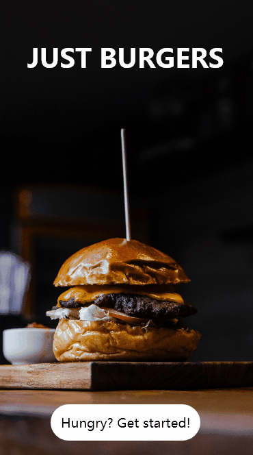

# Burger-app-design
Simple design with prototype done in Adobe Xd for a mobile application for ordering/creating burgers. 

Done while testing usage of animations and transitions in Adobe Xd. 

## Main page

## Menu page

## Build burger animation

